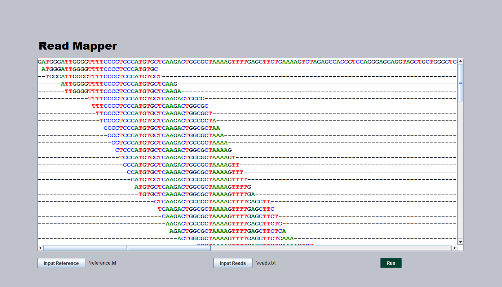

# Basic Read Mapper

Suffix array based implementation of a basic read mapper that takes a reference file in fasta format containing one sequence and a reads file containing multiple sequences in fasta format and aligns the reads to the reference sequence to the user. The aligner handles unique matches and multiple matches and uses a different spacer character for each. When there are multiple matches the spacer changes from ‘-’ to ‘~’ to signify that the match is not unique.

GUI made using Swing allows users to select input files and visualize aligned output.

Project for COMP 271 at LUC
